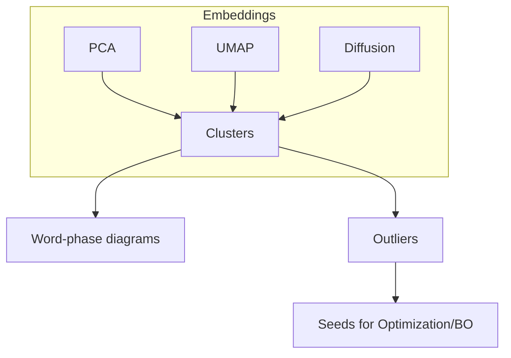

# Polytope Systolic Atlas — Experiments, Datasets & Roadmap (v0.1)

**Date:** 2025-10-09
**Author:** Project team
**Scope:** Planning document for experiments and code modules exploring EHZ capacity, minimal actions, and systolic ratios on convex polytopes in (\mathbb{R}^{2n}).
**Status:** Living document (edit inline; update statuses per idea).

> Disclaimer (candidate choices, non-prescriptive): This RFC lists candidate designs and workflows to enable rapid progress. Treat bullets as options, not mandates. Choose the simplest viable candidate, then iterate based on evidence. Record deviations and rationale inline.

> Scale convention: Generators preserve their natural scale by default (e.g., tangential polytopes with inradius=1). Volume normalization to `vol=1` is optional and provided as a helper for comparability or where an algorithm requires it. Since the systolic ratio is scale-invariant, analyses do not rely on global volume normalization. Always log the scale and a `normalized` tag when applicable.

> Interop & performance: Wrapping SciPy/NumPy under `viterbo/_wrapped/` is acceptable for development speed; port to JAX when performance or algorithmic control demand it. ML models should use JAX in the library; exploratory viz/ML can live in `notebooks/`.

> Alignment: This roadmap serves the MSc Math PP/thesis deliverables and matches the brief “Probing Viterbo’s conjecture” (efficient computation in (\mathbb{R}^4), search for failure regions, ML acceleration). 
> Engineering culture and reproducibility follow our MSc project creation context (clean repo, CI, `results.md`, seeds). 
> Optional verifier‑in‑the‑loop/LLM touches take inspiration from our AI‑for‑math survey notes.
> Tiny formalization toe‑hold ideas reference the DG‑formalization status report. 

---

## 1) Conceptual Modules (Architecture Overview)

Below are the abstract modules the codebase is organized around. Each later section lists concrete, 1‑day‑sized ideas under the module they touch. By default, generators preserve natural scale; `vol=1` normalization is optional and recorded in tags.

```mermaid
flowchart LR
    A[Polytope Generators] --> B[Normalization (optional vol=1) & Tags]
    B --> C[Quantity Computers]
    C --> D[Dataset Store & Certificates]
    D --> E[Landscape Exploration]
    D --> F[ML Surrogates & Search]
    D --> G[Shape Optimization]
    E --> H[Visualization]
    F --> G
    G --> D
    E --> D
    subgraph Infra
      I[CI & Tests]:::infra --> D
      I --> C
      I --> A
    end
classDef infra fill:#f3f3f3,stroke:#666,stroke-width:1px,color:#333
```

### Module Glossary

1. **Polytope Generators** — Produce convex polytopes in (\mathbb{R}^{2n}) (esp. (2n=4), some (2n=6)), including structured grids, random ensembles, and degenerate/extremal families. Default: preserve natural scale.
2. **Normalization & Tags** — Optional `vol=1` rescale helper; ensure origin in interior where required; record tags: central symmetry, product/dual flags, facet/vertex counts, anisotropy stats, `normalized` flag, and scale.
3. **Quantity Computers** — Compute (c_{\mathrm{EHZ}}) via Minkowski billiards on piecewise‑linear boundaries, minimal action cycles, systolic ratio (\mathrm{sys}=A^n/(n!,\mathrm{vol})), spectra, and geometric surrogates/bounds.
4. **Dataset Store & Certificates** — Structured logging (JSONL/Parquet) with explicit H‑rep and V‑rep tables (and product‑form table when applicable) joined by `polytope_id`, plus **verifier‑in‑the‑loop** certificates (bounce word, contact points, reflection residuals, action checks) and timings.
5. **Similarity & Metrics** — Shape, orbit/word, and spectrum distances for clustering and nearest‑neighbor search.
6. **Landscape Exploration** — Unsupervised maps (PCA/UMAP/diffusion), clusters (HDBSCAN), phase diagrams over parameter grids, outlier detection, TDA.
7. **ML Surrogates & Search** — Features, regressors/classifiers, uncertainty; active learning and Bayesian optimization to find high‑(\mathrm{sys}) shapes with fewer EHZ evaluations.
8. **Shape Optimization** — Gradient‑based and gradient‑free methods over support functions/H‑reps; robust objectives and word‑aware continuation.
9. **Visualization** — Per‑row plots (2D×2D factors + billiard), atlas pages (heatmaps, word phases), transition graphs, galleries.
10. **Software Engineering** — Invariance tests, CI, seeds, env lockfiles, experiment harness, `results.md` scaffolds; small certificate checker.

The rest of this document expands each module with concrete, status‑trackable idea lists.

---

## 2) Polytope Generators (Module A)

> **Contract:** `generate(params) -> Polytope` (natural scale). Optionally: `normalize_volume(Polytope) -> Polytope(vol=1)`. Always log scale and `normalized` tag.

### A.1 Structured Enumerations in (\mathbb{R}^4)

* **Regular product grid:** (K_m \times T_k), (m,k\in{4,6,8,10,12,\dots,30}). — *status: proposed*
* **Rational rotations:** (K_m \times R_\theta T_k) with (\theta=\tfrac{p}{q}\pi), small coprime (p,q). — *status: proposed*
* **Dual products:** (K_m \times K_m^\ast) via polygonal support sampling (Mahler‑adjacent). — *status: proposed*
* **Zonotope products:** (Z(u_1,\dots,u_r) \times Z(v_1,\dots,v_s)) with integer direction sets. — *status: proposed*
* **Facet‑budget sweep (general):** centrally symmetric H‑reps with (m\in{8,12,16,20,24}). — *status: proposed (candidate)*

### A.2 Random Ensembles

* **H‑rep normal+offset:** facet normals on (S^3), offsets in a band; optional `vol=1` rescale for comparability. — *status: proposed (candidate)*
* **John‑ellipsoid aligned:** sample anisotropy by scaling along random orthogonal frames; renorm vol=1. — *status: proposed*
* **Zonotope sums:** Minkowski sum of (r) random segments; knob (r). — *status: proposed*
* **Vertex‑cloud hulls:** convex hull of paired (v,-v) to enforce central symmetry. — *status: proposed*
* **Noise‑stability clouds:** jitter around a seed (counterexample/product), (\sigma\in{10^{-4},10^{-3},10^{-2}}). — *status: proposed*

### A.3 Degenerate/Extremal & Constrained

* **Inradius‑1 tangential:** all supporting halfspaces at distance 1 from 0; vary facet directions. — *status: proposed (natural scale default)*
* **Width‑constrained:** fix min/max supports along a frame; sweep anisotropy. — *status: proposed*
* **Facet‑sparseness extremes:** near‑simplicial vs near‑zonotopal for the same facet budget. — *status: proposed*
* **Word‑templated shapes:** back‑engineer facet orientations from a target bounce word. — *status: proposed*
* **Counterexample neighborhood (HK–O):** 2–4 param deformations, tight grids. — *status: proposed*  

### A.4 Dimensional Lifts & Cross‑Checks

* **(\mathbb{R}^6) slices:** ((K_m\times T_k)\times L_\ell), total vol=1. — *status: proposed*
* **Cylindrical lifts:** (P_4\times I_\epsilon\times I_\epsilon) to sanity‑check capacity scaling. — *status: proposed*

---

## 3) Quantity Computers (Module B)

> **Contract:** `ehz(poly, init_policy='multi') -> {c_ehz, bounce_word, action_min, action_gap, spectrum, cert, timings}`

### B.1 Core Symplectic Quantities

* **EHZ capacity (c_{\mathrm{EHZ}})** via Minkowski billiards on PL boundaries. — *status: proposed*
* **Minimal action cycle** and **bounce word** (facet sequence) achieving (c_{\mathrm{EHZ}}). — *status: proposed*
* **Systolic ratio** (\mathrm{sys}=A_{\min}^n/(n!,\mathrm{vol})) (scale‑invariant; no global normalization required). — *status: proposed*
* **Discrete action spectrum**: top‑K stationary orbits (actions+words+stability margins). — *status: proposed*

### B.2 Secondary/Bounding Quantities

* **John/Löwner ellipsoids**: axes, aspect, orientation; capacity bounds via monotonicity/containment. — *status: proposed*
* **Mean width & support moments**: (\int h(\theta),d\theta), variance; **facet‑normal entropy**. — *status: proposed*
* **f‑vector & adjacency graph**: spectral stats for combinatorial features. — *status: proposed*
* **Robustness metrics**: action gap (1st vs 2nd), word agreement across inits/perturbations. — *status: proposed*
* **Timing/compute**: compile/eval ms, restarts, line searches. — *status: proposed*

### B.3 Optional additional capacities (stretch)

* **Cylindrical capacity** (c_{\mathrm{cyl}}) or comparison surrogates where computable. — *status: proposed*
* **Other symplectic surrogates** from ellipsoidal/cylindrical embeddings as sanity checks. — *status: proposed*

---

## 4) Dataset Store & Certificates (Module C)

> **Contract:** `log_row(params, summaries, ehz_result) -> append(dataset)`; `verify(cert) -> residuals/pass`

Representations: Maintain explicit H‑rep and V‑rep tables and, when applicable, a product‑form table. Join these by a shared `polytope_id`. Algorithms accept multiple representations via lightweight multi‑dispatch with on‑demand conversion.

### C.1 Row Schema (JSONL/Parquet)

Each row contains:

```
shape_id, family, params, dim, vol, normalized(bool), scale,
c_ehz, sys, spectrum[topK], bounce_word, bounce_count, action_min, action_gap,
csym(bool), n_facets, n_vertices, facet_entropy, john_axes, john_aspect,
compile_ms, eval_ms, restarts, seed,
cert{points, normals, reflection_residuals, action_integral_check}
```

— *status: proposed*

### C.2 Certificates & Checker

* Emit a **certificate** per minimizing cycle; ship a tiny **checker** (LP/geometry) to re‑verify reflection law and action integral. Initially emphasize outlier detection (flag unusual residuals); pass thresholds TBD and tightened iteratively. — *status: proposed*
  *Motivation:* verification‑in‑the‑loop is the credible pattern for AI‑math pipelines; gives auditable artifacts.

### C.3 Normalizers & Tags

* Optional volume rescale to `vol=1`; tag `normalized` (bool), `scale` (float), central symmetry, product/dual flags, facet/vertex counts, anisotropy features. — *status: proposed*

### C.4 Determinism & Provenance

* Seeds, env lockfiles, git SHA, code version; per‑run `results.md` auto‑stubs. — *status: proposed*  

---

## 5) Similarity & Distances (Module D)

### D.1 Shape Distances (origin inside; optional vol=1)

* **Support (L^p)**: ( |h_K - h_L|_{L^p(S^{d-1})} ) on a fixed grid. — *status: proposed*
* **Hausdorff via support**: ( |h_K-h_L|_{L^\infty} ). — *status: proposed*
* **Normal‑direction EMD**: earth‑mover on facet‑normal histograms (antipodal identified). — *status: proposed*
* **Adjacency‑graph spectral/edit** distance. — *status: proposed*
* **Banach–Mazur proxy**: minimize support distance over a small linear map class. — *status: proposed*

### D.2 Orbit/Word Distances

* **Cyclic‑aware Levenshtein** on facet sequences. — *status: proposed*
* **N‑gram grammar distance** on words. — *status: proposed*
* **Geometric orbit RMS** after reparametrization. — *status: proposed*

### D.3 Spectrum Distances

* **Action gaps** and **top‑K match** cost (min bipartite |Δaction|). — *status: proposed*

---

## 6) Landscape Exploration (Module E)

### E.1 Embeddings

* **PCA** on standardized geometry features. — *status: proposed*
* **UMAP / t‑SNE** on concatenated shape+spectrum features (scaled). — *status: proposed*
* **Diffusion maps** for smooth deformations. — *status: proposed*



### E.2 Clustering & Phase Diagrams

* **HDBSCAN** clusters; overlay dominant **minimizing word** per cluster. — *status: proposed*
* **Word‑phase tilings** over ((m,k)) grids; color by word family. — *status: proposed*
* **Transition graphs**: nodes = words; edges = observed word changes under small param steps. — *status: proposed*

### E.3 Outliers & Novelty

* **Isolation Forest / LOF** to spot unusual (\mathrm{sys}) or rare words. — *status: proposed*
* **Counterexample basins**: visualize connected components of ({\mathrm{sys}>1}) in local charts. — *status: proposed*  

### E.4 Topological Data Analysis (lightweight)

* **Persistent H1** on embedded point clouds. — *status: proposed*
* **Mapper** with lens = diffusion coordinates, color = (\mathrm{sys}). — *status: proposed*

---

## 7) ML Surrogates & Search (Module F)

> **Goal:** Reduce EHZ evaluations per “hit” and predict combinatorics of minimizers.

> **Framework:** Use JAX for core ML models for performance and code consistency. Exploratory ML and visualization can live in notebooks; production loops reside in the library.

### F.1 Features

* **Geometry‑lite**: (n_\text{facets}), csym flag, facet entropy, mean width, John axes/aspect. — *status: proposed*
* **Support samples**: (h(\theta_j)) on fixed grids; Fourier/spherical coefficients. — *status: proposed*
* **Word features**: n‑gram frequencies, bounce count. — *status: proposed*
* **Runtime hints**: eval ms, restarts. — *status: proposed*

### F.2 Models

* **Small MLP (JAX)** with MC‑dropout uncertainty. — *status: proposed*
* **Tree baselines (optional, wrapped)** (XGBoost / RF) for quick reference; lives under `_wrapped/`. — *status: optional*
* **Gaussian Process** over low‑dim summaries for sample‑efficient BO. — *status: proposed*
* **Sequence classifier** for predicting the minimizing **word**. — *status: proposed*
* **(Optional) Graph models** on facet adjacency. — *status: proposed*

### F.3 Search Loops

* **Bayesian Optimization** (UCB/TS) on paramized families; verify with EHZ; iterate. — *status: proposed*
* **Active learning**: sample where predictive variance is high; report EHZ‑saves per hit. — *status: proposed*
* **CMA‑ES / NES** baselines on support parameters. — *status: proposed*
* **Template‑guided search**: condition on desired word families, then optimize nearby. — *status: proposed*

### F.4 Verification‑first ML

* Always log **predictions + certificate‑verified labels**; publish PR curves for the rare class. — *status: proposed*

---

## 8) Shape Optimization (Module G)

> **Parametrizations:** (i) Support function samples (h(\theta_j)) with convexity barrier; (ii) H‑rep offsets along fixed normals; (iii) factorized 2D×2D products.

### G.1 Objectives & Constraints

* **Maximize (\mathrm{sys})** with per‑step volume rescale. — *status: proposed*
* **Robust (\mathrm{sys})**: maximize expected value under small param noise. — *status: proposed*
* **Multi‑objective**: (\mathrm{sys}) vs facet budget vs anisotropy. — *status: proposed*
* **Word‑targeted continuation**: penalize changes away from a chosen word. — *status: proposed*

### G.2 Algorithms

* **Adam/SGD** multistart; early‑stop on small relative gains. — *status: proposed*
* **L‑BFGS** on soft‑min surrogates (smooth over near‑optimal words). — *status: proposed*
* **CMA‑ES / CEM** gradient‑free baselines. — *status: proposed*
* **Hybrid BO + gradient polish**. — *status: proposed*

### G.3 Certification of Improvements

* Track **action‑gap widening** & **word stability** along the path; re‑verify certificates each checkpoint. — *status: proposed*

---

## 9) Visualization (Module H)

Preferred workflow: build reusable, non-interactive plotting kernels in the library; drive exploratory visuals from `notebooks/`.

### H.1 Per‑row Panel (reusable)

* 2D×2D factors with **minimizing billiard** overlay, mini spectrum bar, word glyph. — *status: proposed*

### H.2 Atlas Pages

* For each dataset: heatmap of (\mathrm{sys}); word‑phase tiling; stability violin/gap bars. — *status: proposed*

### H.3 Transition Graph

* Nodes = words; edge thickness = frequency of transitions under small perturbations. — *status: proposed*

### H.4 Top‑shapes Gallery

* SVGs of factor polygons for top‑k (\mathrm{sys}) per family; link certificates. — *status: proposed*

### H.5 Compute Footprint

* Violin plot of eval times across families (to justify ML acceleration). — *status: proposed*

---

## 10) Software Engineering & Reproducibility (Module I)

### I.1 Tests & Invariances

* Scale invariance ((c_{\mathrm{EHZ}}(\lambda X)=\lambda^2 c_{\mathrm{EHZ}}(X)), (\mathrm{vol}(\lambda X)=\lambda^{2n})); **sys** flat vs (\lambda). Tests rely on invariance; normalization is optional. — *status: proposed*
* Symplectic invariance tests (already present; extend as regression panel). — *status: proposed*
* Reflection‑law residual & action integral checks (certificate verifier in CI). — *status: proposed*

### I.2 Harness & Results

* `results.md` autogeneration per run; seeded determinism; environment lockfiles; Git SHA in metadata. — *status: proposed*  

### I.3 Minimal APIs (stubs)

```
generate(params) -> Polytope  # natural scale
normalize_volume(poly) -> Polytope(vol=1)  # optional helper
ehz(poly, init_policy='multi') -> {...}  # scale handled by sys; no global normalization required
summarize(poly) -> {vol, csym, n_facets, ...}
log_row(params, summaries, ehz_result) -> None
plot_row(row) -> Figure
verify(cert) -> {residuals, pass}
```

— *status: proposed*

---

## 11) Experiment Playbooks (1‑day sprints)

> Each playbook is designed to be tractable in ~1 day end‑to‑end (code + tests + plots). Start with ~10^2 rows to validate pipelines; scale up once stable.

### P.1 Micro‑Grid for Regular Products ((m\times k))

* **Do:** Generate (K_m\times T_k), (m,k\in{4,6,8,10,12}); compute/log; plot (\mathrm{sys}) heatmap + word phase. Preserve natural scale; add a derived `normalized` variant only if needed for comparisons. — *status: proposed*
* **Why:** Exercises full spine; produces first atlas page. — *status: proposed*

### P.2 Perturbation Robustness (Single Cell)

* **Do:** Pick one ((m,k)); jitter facets at (\sigma\in{10^{-4},10^{-3},10^{-2}}); renorm vol=1; plot (\mathrm{sys}) distribution, %((\mathrm{sys}>1)), action‑gap violins. — *status: proposed*

### P.3 Counterexample Neighborhood (2‑param chart)

* **Do:** 21×21 grid around HK–O parameters; log %((\mathrm{sys}>1)); overlay dominant words. — *status: proposed*  

### P.4 Dual Products (K\times K^\ast)

* **Do:** Polygonal approximations, vary (m\in{6,\dots,20}); compare (\mathrm{sys}) vs anisotropy/entropy. — *status: proposed*

### P.5 Gradient Ascent (Support Params)

* **Do:** Multistart Adam ((m=12)); track best shapes/words; certify improvements. — *status: proposed*

### P.6 ML Baseline

* **Do:** JAX MLP (\mathrm{sys}) regressor + (\mathrm{sys}>1) classifier on features; calibrated PR; rank 200 candidates; report EHZ‑saves per hit. Optional tree baselines under `_wrapped/` for reference. — *status: proposed*

---

## 12) Long‑Horizon Goals (5‑month arc)

1. **Polytope Systolic Atlas v1.0** — Datasets (natural scale with `normalized`/`scale` tags; normalized variants as needed), atlas figures, certificate checker, and a clean report. — *status: proposed*  
2. **Systolic Search Engine v1** — Surrogates + BO/active learning loops; top shapes with robustness neighborhoods. — *status: proposed*
3. **(Optional) Micro‑formalization Toe‑hold** — one lemma/certificate‑soundness note (Lean or Naproche). — *status: proposed*  

**Suggested allocation of ~75 coding days** (modular; pick & mix):

* **Datasets (~15 d):** Generators (A.1–A.4). — *status: proposed*
* **Quantities & Certs (~10 d):** B.2 + C.2 + distances. — *status: proposed*
* **Landscape (~12 d):** E.1–E.3 + word‑phase diagrams. — *status: proposed*
* **ML & Search (~18 d):** F.1–F.4 + BO loops. — *status: proposed*
* **Optimization & Robustness (~10 d):** G.1–G.3 + noise studies. — *status: proposed*
* **Viz & Engineering (~10 d):** H.1–H.5 + I.1–I.3. — *status: proposed*
* **Stretch (0–5 d):** New classes (bounds, smoothing homotopy, adversarial). — *status: proposed*

---

## 13) New Classes & Stretch Ideas (Cross‑module)

### K.1 Combinatorics‑First

* **Word grammar mining**: frequent sub‑phrases correlating with high (\mathrm{sys}). — *status: proposed*
* **Bounce count vs phases**: detect jumps at boundaries. — *status: proposed*

### K.2 Bounds & Comparison Geometry

* **Capacity sandwiching**: ellipsoidal bounds; track tightness per family. — *status: proposed*
* **Mahler‑adjacent probes**: (\mathrm{sys}(K\times K^\ast)) vs anisotropy/volume‑product surrogates. — *status: proposed*  

### K.3 Robustness Science

* **Adversarial perturbations**: smallest change pushing (\mathrm{sys}) below 1; visualize boundaries. — *status: proposed*
* **Smoothing/rounding homotopy**: Minkowski sum with small disk; compare polyhedral vs smooth. — *status: proposed*

### K.4 Reverse Problems

* **Inverse‑word design**: optimize shapes realizing a target word with high (\mathrm{sys}). — *status: proposed*
* **Target spectrum shaping**: match a prescribed small set of actions. — *status: proposed*

### K.5 Verification & (Micro) Formalization

* **Certificate ⇒ bound lemma**: if residuals < (\varepsilon) then action error < (\delta). — *status: proposed*  
* **Naproche note**: PL reflection law write‑up with checker. — *status: proposed*

---

## 14) References & Alignment Notes

* **Thesis topics — “Probing Viterbo’s conjecture”**: compute systolic ratios in (\mathbb{R}^4); map failure regions; ML to accelerate search. Our Modules A–H implement this brief directly. 
* **Project creation context**: repo hygiene, CI, results discipline — mirrored by Module I. 
* **LLM‑math (verifier‑in‑the‑loop) survey**: justifies Certificates + Checker and cautious ML integration in Modules C/F.
* **DG formalization status**: micro‑formalization ideas in K.5 are scoped to be feasible and additive. 

---

*Change log:*

* v0.1 — initial comprehensive roadmap; statuses set to **proposed** throughout.
