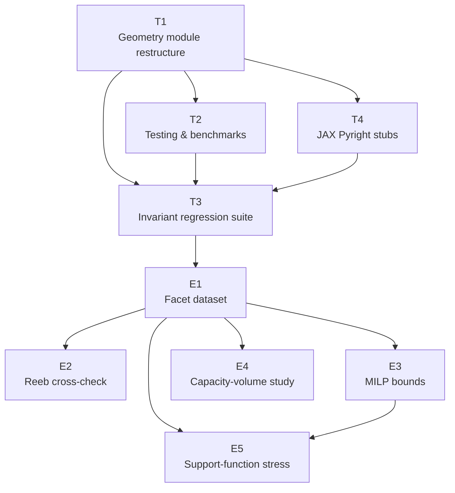

# Task and Experiment Portfolio

This portfolio tracks the high-leverage work derived from
`docs/algorithm-implementation-plan.md` and the broader MSc thesis roadmap. Each
item links to a dedicated brief inside `docs/tasks/`, allowing Codex agents to
pick up execution with minimal context switching while keeping prioritisation
visible at a glance.

## 1. Portfolio snapshot

| ID | Brief | Status | Expected utility | Cost (agent / compute / expert) | Priority | Notes |
| --- | --- | --- | --- | --- | --- | --- |
| T1 | [Geometry quantity module restructure & JAX baselines](completed/2025-10-04-geometry-module-refactor.md) | Completed | **+3.15** | Medium / Low / Low | — | Root of SWE work; enables all downstream experiments. |
| T2 | [Testing, benchmarking, and profiling harness](scheduled/2025-10-04-testing-benchmark-harness.md) | Scheduled | **+2.30** | Medium / Low / Low | 0.5 | Ready to execute now that T1 fixtures shipped; secures regression safety. |
| T3 | [Symplectic invariants regression suite](scheduled/2025-10-05-symplectic-invariant-regression-suite.md) | Scheduled | **+2.50** | Medium / Low / Medium | 0.75 | Hardens invariants before dataset work. |
| T4 | [JAX Pyright stub integration](scheduled/2025-10-06-jax-pyright-stubs.md) | Scheduled | **+2.10** | Medium / Low / Low | 0.60 | Unlocks strict typing for JAX-backed modules. |
| E1 | [Facet-normal validation & dataset build](draft/2025-10-04-facet-dataset.md) | Draft | **+2.70** | Medium / Low / Low | 1 | First numerical experiment; seeds data for the rest. |
| E2 | [Reeb orbit cross-check](draft/2025-10-04-reeb-cross-check.md) | Draft | **+2.10** | Medium / Low / Low | 2 | Tests numerical agreement across methods. |
| E3 | [MILP relaxation bounds](draft/2025-10-04-milp-relaxations.md) | Draft | **+1.40** | Medium / Medium / Medium | 3 | Evaluates feasibility of open-source MILP tooling. |
| E4 | [Capacity–volume correlation study](draft/2025-10-04-capacity-volume-study.md) | Draft | **+1.80** | Medium / Medium / Medium | 4 | Mines dataset for trends and outliers. |
| E5 | [Support-function relaxation stress test](draft/2025-10-04-support-function-stress.md) | Draft | **+0.90** | Medium / Medium / Low | 5 | Probes robustness of relaxation techniques. |

Expected utilities remain the sum of probability-weighted utilities captured in
the owning briefs. Priorities reflect the qualitative ordering: complete T1–T3
before launching the dataset or analysis experiments.

## 2. Dependency structure

Update this graph whenever briefs change status or new items enter the queue.

## 3. Item summaries

### T1 — Geometry quantity module restructure & JAX baselines
- **Brief**: [`docs/tasks/completed/2025-10-04-geometry-module-refactor.md`](completed/2025-10-04-geometry-module-refactor.md)
- **Why it matters**: establishes the quantity-first package layout, harmonises
  reference/optimised/JAX implementations, and seeds example datasets so later
  experiments can rely on consistent APIs.
- **Status**: Completed — downstream work (T2, T3) can now assume the new layout.

### T2 — Testing, benchmarking, and profiling harness
- **Brief**: [`docs/tasks/scheduled/2025-10-04-testing-benchmark-harness.md`](scheduled/2025-10-04-testing-benchmark-harness.md)
- **Why it matters**: secures regression safety now that T1 landed, provides pytest
  benchmark tiers, and documents profiling recipes aligned with the agreed
  cadence.
- **Next checkpoint**: validate smoke benchmark runtime (<5 minutes) before
  enabling in CI.

### T3 — Symplectic invariants regression suite
- **Brief**: [`docs/tasks/scheduled/2025-10-05-symplectic-invariant-regression-suite.md`](scheduled/2025-10-05-symplectic-invariant-regression-suite.md)
- **Why it matters**: codifies core invariants across reference/optimised/JAX implementations so downstream experiments inherit
  trusted guarantees and surface failures quickly.
- **Next checkpoint**: confirm the invariant inventory with the maintainer and
  stabilise smoke/deep marker runtimes.

### T4 — JAX Pyright stub integration
- **Brief**: [`docs/tasks/scheduled/2025-10-06-jax-pyright-stubs.md`](scheduled/2025-10-06-jax-pyright-stubs.md)
- **Why it matters**: operationalises the stub strategy from RFC 002 so JAX-backed modules stay type-safe under Pyright strict.
- **Next checkpoint**: integrate the stub tree and supporting docs before resuming geometry enhancements.

### E1 — Facet-normal validation & dataset build
- **Brief**: [`docs/tasks/draft/2025-10-04-facet-dataset.md`](draft/2025-10-04-facet-dataset.md)
- **Why it matters**: produces the canonical dataset feeding all other
  experiments, exercises algorithm variants, and surfaces anomalies early.
- **Next checkpoint**: choose storage format and confirm reproducibility before
  scaling to larger batches.

### E2 — Reeb orbit cross-check
- **Brief**: [`docs/tasks/draft/2025-10-04-reeb-cross-check.md`](draft/2025-10-04-reeb-cross-check.md)
- **Why it matters**: compares Reeb orbit estimators across algorithm families to
  highlight disagreements requiring theoretical attention.
- **Next checkpoint**: inventory available methods and ensure dataset interfaces
  cover their prerequisites.

### E3 — MILP relaxation bounds
- **Brief**: [`docs/tasks/draft/2025-10-04-milp-relaxations.md`](draft/2025-10-04-milp-relaxations.md)
- **Why it matters**: quantifies the value of open-source MILP tooling without
  relying on commercial solvers; informs whether tighter relaxations are worth
  pursuing.
- **Next checkpoint**: run pilot instances to confirm solver feasibility and log
  runtime before scaling.

### E4 — Capacity–volume correlation study
- **Brief**: [`docs/tasks/draft/2025-10-04-capacity-volume-study.md`](draft/2025-10-04-capacity-volume-study.md)
- **Why it matters**: searches for empirical structure in the dataset that could
  generate new conjectures or spotlight counterexamples.
- **Next checkpoint**: agree on statistical tooling and ensure notebook
  reproducibility fits within benchmark budgets.

### E5 — Support-function relaxation stress test
- **Brief**: [`docs/tasks/draft/2025-10-04-support-function-stress.md`](draft/2025-10-04-support-function-stress.md)
- **Why it matters**: tests robustness of relaxation strategies, feeding fixes or
  de-risking future experiments.
- **Next checkpoint**: gather scenarios from E1–E3 anomalies before executing the
  stress suite.

## 4. Long-haul benchmarking cadence

Long-haul benchmarks (>1 hour) should run **monthly** or before major milestones
such as landing T1/T2 or publishing new datasets. Capture outcomes by:

1. Saving raw measurements with `pytest --benchmark-autosave` (stored under
   `.benchmarks/`).
2. Adding a brief narrative (command, hardware, notable deltas) to the relevant
   task brief or weekly progress report immediately after the run so future work
   does not rely on memory.

Escalate to the maintainer if a long-haul run shows >10% regression or if
hardware limits block completion. For HPC/ML experiments include dataset scale,
hardware type, precision, and random seeds so future agents can reproduce the
results or compare against CI artefacts.
